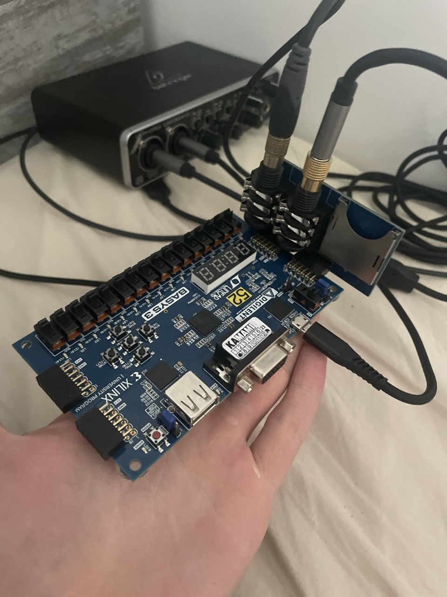
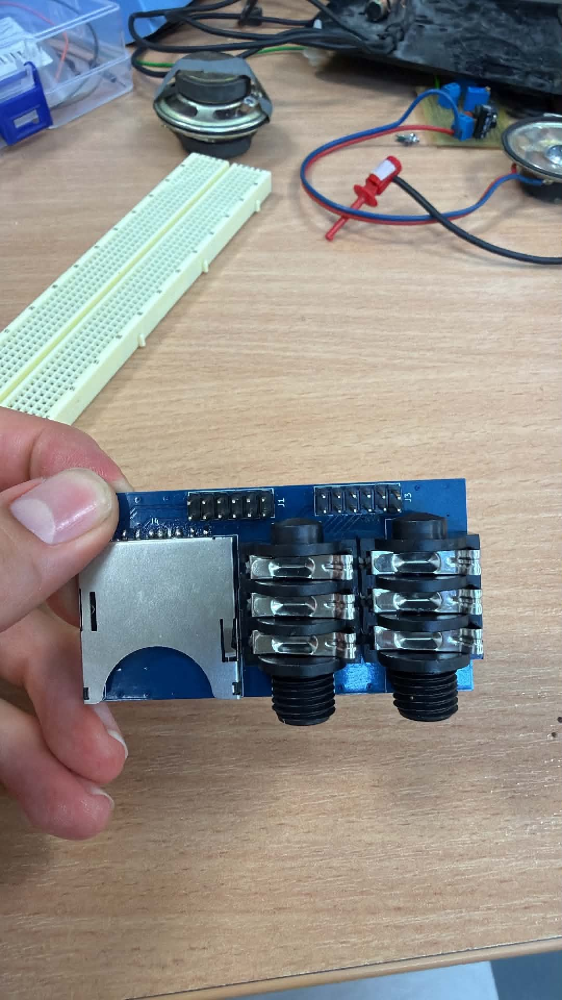
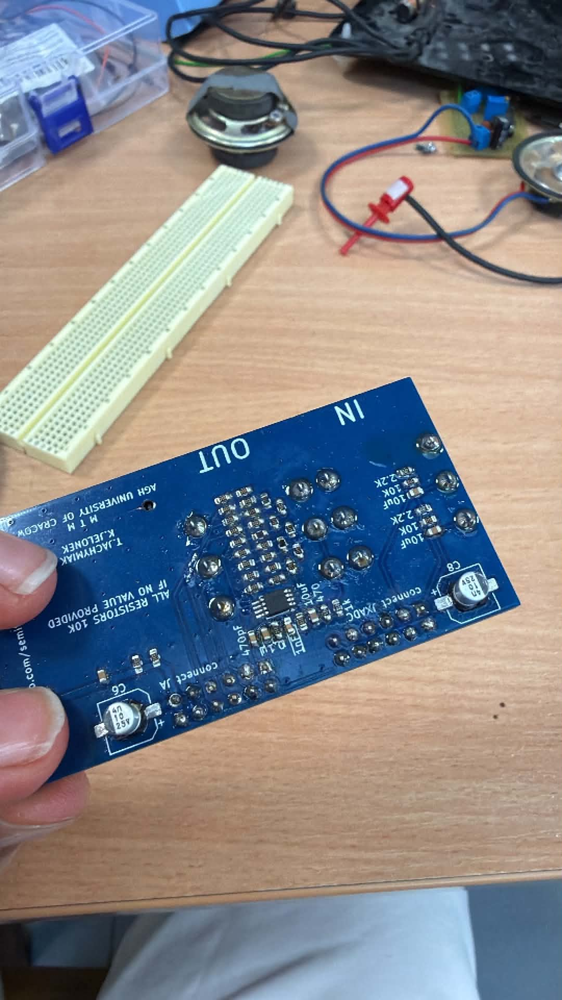
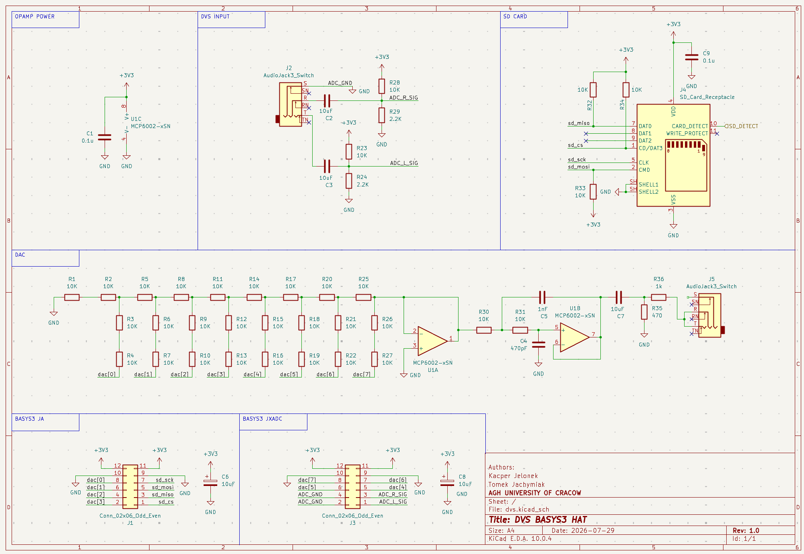
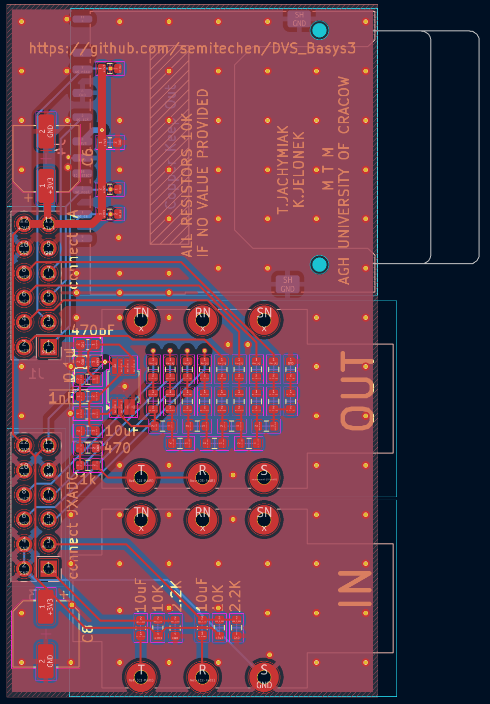

# 🎧 Digital Vinyl System (DVS) on FPGA Basys 3

[](https://www.xilinx.com)
[](https://en.wikipedia.org/wiki/SystemVerilog)
[](https://www.xilinx.com/products/design-tools/vivado.html)
[](https://www.kicad.org)
[-brightgreen.svg)](#fpga-resource-utilization--timing-closure)
[](LICENSE)

An autonomous, ultra-low-latency **Digital Vinyl System (DVS)** and lossless SD audio player implemented entirely in hardware on dual **Digilent Basys 3 (Xilinx Artix-7)** FPGA boards and custom analog front-end / R-2R DAC PCB shields.

---

## 🎬 Video Demonstration

Click the preview below to watch the complete hardware setup in action, demonstrating real-time scratch, pitch-shifting, backward playback, cueing, track selection, and autonomous QSPI Flash boot:

[](https://youtu.be/QSMYIAcXrho)

---

## 📸 Hardware Gallery

<p align="center">
  
  <br>
  <em>Figure 1: Complete real-time test bench with analog turntable (Serato 1 kHz timecode vinyl), custom pre-amp/filter shield, Board A (Streamer), Board B (DAC Receiver), and audio output.</em>
</p>

<p align="center">
  
  
  <br>
  <em>Figure 2: Custom AC-coupling pre-amplifier, active Sallen-Key low-pass filter, and 8-bit R-2R resistor ladder DAC PCB shield designed for Basys 3 Pmod headers.</em>
</p>

---

## 📌 Project Overview & Motivation

### Why Hardware DVS?
In modern DJing, **Digital Vinyl Systems (DVS)** bridge tactile analog turntables with digital music libraries. However, commercial DVS setups require:
1. A laptop running resource-intensive software (Serato, Traktor, Rekordbox).
2. Dedicated USB soundcards.
3. Operating system audio buffers (introducing $5\text{--}20\text{ ms}$ of latency, audio dropouts, and CPU jitter).

### The FPGA Solution
This project eliminates the computer entirely. By executing all timecode signal processing, quadrant phase decoding, flash memory DMA, rate modulation, and audio reconstruction **directly in FPGA silicon at 100 MHz**:
* **Sub-Microsecond Latency:** From vinyl needle motion to DAC audio output in $< 5.0\,\mu\text{s}$.
* **Zero Software Dependency:** Autonomous non-volatile boot from onboard QSPI Flash.
* **Lossless Playback:** Real-time variable-rate streaming of uncompressed 8-bit PCM audio ($44.1\text{ kHz}$) directly from FAT-less micro-SD sectors.
* **Audiophile Reconstruction:** 16x oversampling engine with a 1st-order Noise Shaper ($1 - z^{-1}$) and Triangular Probability Density Function (TPDF) dither, dramatically suppressing resistor ladder quantization noise.

---

## 🏛️ System Architecture

The project employs a distributed **Dual-Board FPGA Architecture** linked by a dedicated **2,000,000 baud (2 Mbps)** UART audio bus:

```
+---------------------------------------------------------------------------------------------------------+
|                                    BOARD A: TIME-CODE STREAMER & SD PLAYER                              |
|                                                                                                         |
|  [Turntable] ---> [Custom PCB Pre-amp] ---> [XADC (vauxp6/14)]                                          |
|                                                     |                                                   |
|                                            [xadc_interface]                                             |
|                                                     | x2t (12-bit L/R @ 100 kHz)                        |
|                                                     v                                                   |
|                                          [timecode_pos_tracker] <---> [led_pos_display] (16 LEDs)        |
|                                                     |                                                   |
|                                                     | t2p (Q4.12 Speed, Direction, Squelch)             |
|                                                     v                                                   |
|  [Micro-SD] <--- [sd_card_controller] <--- [sd_bram_bridge]                                            |
|                       (16.67 MHz SPI)               | b2f (512-byte Sector Writes)                      |
|                                                     v                                                   |
|                                              [audio_fifo] (1024-byte Dual-Port BRAM)                    |
|                                                     |                                                   |
|                                                     | f2p (Read FIFO Sample)                            |
|                                                     v                                                   |
|                                         [variable_speed_player] (NCO Phase Acc)                         |
|                                                     |                                                   |
|                                                     | p2u (8-bit PCM Sample Valid)                      |
|                                                     v                                                   |
|                                                [uart_tx] (2 Mbps Transmitter)                           |
+-----------------------------------------------------|---------------------------------------------------+
                                                      | Pmod JC1 (K17) + GND
                                                      | 2.0 Mbps Audio Stream
+-----------------------------------------------------v---------------------------------------------------+
|                                      BOARD B: DAC & VISUALIZATION ENGINE                                |
|                                                                                                         |
|                                                [uart_rx] (2 Mbps Receiver)                              |
|                                                     |                                                   |
|                                                     | u2d (8-bit PCM Sample Valid)                      |
|                                                     v                                                   |
|       +---------------------------------------------+---------------------------------------------+     |
|       |                                                                                           |     |
|       v                                                                                           v     |
|  [audio_watchdog] (200 ms Timeout)                                                           [vu_meter] |
|       |                                                                                           |     |
|       v                                                                                           v     |
|  [r2r_dac] (16x Oversampling, 1st-Order Noise Shaping, TPDF Dither)                         [LED 11:0]  |
|       |                                                                                   (12-LED VU)   |
|       v (dac[7:0])                                                                                      |
|  [8-bit R-2R Resistor Ladder] ---> [Active Sallen-Key Low-Pass Filter] ---> [Audio Output / Amp]        |
+---------------------------------------------------------------------------------------------------------+
```

---

## 🔬 Deep-Dive: Core DSP & Hardware Modules

### 1. Dual-Channel XADC & Dynamic DC Estimator (`xadc_interface.sv`)
* Samples differential analog timecode inputs from Pmod JXADC (`vauxp6/vauxn6` for Left, `vauxp14/vauxn14` for Right).
* A 32-bit fixed-point 1st-order IIR low-pass filter dynamically tracks and subtracts the DC bias offset ($\approx 0.6\text{ V}$ operating point), ensuring pure zero-centered AC timecode signals.

### 2. High-Sensitivity Squelch & 4x Quadrature Decoder (`timecode_pos_tracker.sv`)
* **Hysteresis Schmitt-Triggers:** Dual digital Schmitt-triggers reject vinyl groove noise while tracking low-amplitude signals down to $16\text{ mV}$.
* **Envelope Squelch Gate:** Computes signal envelope with fast attack and exponential decay. If the needle is lifted ($< 20\text{ mV}$), the audio player is instantly muted.
* **4x Gray-Code State Machine:** Decodes state transitions $((0,0) \to (0,1) \to (1,1) \to (1,0))$, generating 4 step pulses per $1\text{ kHz}$ timecode cycle ($11.025$ audio samples per step).
* **Sequential Multi-Cycle Divider:** Measures clock cycles between pulses and executes an iterative 16-cycle restoring division ($102,400,000 / \Delta t$) to compute the exact speed factor in **Q4.12 fixed-point** ($16'\text{h}1000 = 1.0\times$) with zero combinational timing violations.

### 3. SPI SD Card Controller & BRAM Ring Buffer (`sd_card_controller.sv`, `sd_bram_bridge.sv`, `audio_fifo.sv`)
* High-speed SPI master operating at **16.67 MHz** (after 200 kHz CMD0/CMD8/ACMD41/CMD16 initialization).
* Issues single-block read commands (`CMD17`) to fetch uncompressed 512-byte PCM audio sectors into a 1024-byte dual-port Block RAM FIFO (`audio_fifo.sv`), maintaining an autonomous prefetch waterlevel.

### 4. Numerically Controlled Oscillator (NCO) Player (`variable_speed_player.sv`)
* A 32-bit phase accumulator driven by the formula:
  $$\Delta \text{Phase} = \frac{44100 \times 2^{32}}{100\,000\,000} \times \text{speed\_factor}$$
* Overflow pulses generate exact, cycle-accurate FIFO read requests, enabling continuous variable-speed pitch modulation from $0.01\times$ to $4.0\times$, forward and backward scratching.

### 5. 2 Mbps High-Speed Inter-Board UART (`uart_tx.sv`, `uart_rx.sv`)
* Transmits 8-bit audio frames across Pmod JC1 (`K17`) at **2,000,000 baud** ($50\text{ clock cycles per bit}$ at 100 MHz, $0.00\%\text{ baud error}$).
* Transmission time is only $5.0\,\mu\text{s}$ per byte, allowing real-time sample transmission with zero FIFO buffering on Board B.
* Includes a **200 ms watchdog** on Board B that smoothly returns the DAC to mid-scale silence ($128 / 1.65\text{ V}$) if the communication cable is unplugged.

### 6. 16x Noise-Shaped DAC Engine (`r2r_dac.sv`)
* **16x Oversampling:** Interpolates $44.1\text{ kHz}$ PCM to $705.6\text{ kHz}$.
* **1st-Order Noise Shaping:** Implements a closed-loop error-feedback filter ($H(z) = 1 - z^{-1}$) shifting quantization noise into the inaudible ultrasonic spectrum ($> 50\text{ kHz}$).
* **TPDF Dither:** Employs dual Galois Linear Feedback Shift Registers (LFSR) generating Triangular Probability Density Function dither to eliminate harmonic distortion and limit cycles.

---

## 📐 Custom PCB: Pre-Amplifier & R-2R DAC Shield

The project includes a custom 2-layer PCB shield designed in KiCad 8 that mounts directly onto the Basys 3 Pmod headers (`pcb/` directory):

<p align="center">
  
  <br>
  <em>Figure 3: KiCad Schematic showing dual-channel AC coupling, DC bias network, 2nd-order active Sallen-Key low-pass filter, and 8-bit R-2R resistor DAC ladder.</em>
</p>

<p align="center">
  
  <br>
  <em>Figure 4: KiCad 2-layer PCB layout with dedicated analog/digital ground separation and ultra-compact Pmod form-factor.</em>
</p>

---

## 🎛️ Hardware Setup & Pinout Guide

### Board A: Timecode Streamer (`top_board_a_streamer`)
| Function | Basys 3 Pin | Header / Pin Name | Description |
| :--- | :---: | :---: | :--- |
| **System Clock** | `W5` | `CLK` | 100.00 MHz onboard oscillator |
| **Global Reset** | `U18` | `BTNC` | Pushbutton active-high synchronous reset |
| **Track Next** | `T18` | `BTNU` | Advance to next audio track |
| **Track Prev** | `U17` | `BTND` | Return to previous audio track |
| **Mode Switch** | `V17` | `SW0` | `1` = DVS Vinyl Control, `0` = Standalone Auto-Play |
| **Timecode L+ / L-** | `J3` / `K3` | Pmod JXADC Pin 1 / 7 | Left channel differential input (`vauxp6/vauxn6`) |
| **Timecode R+ / R-** | `L3` / `M3` | Pmod JXADC Pin 2 / 8 | Right channel differential input (`vauxp14/vauxn14`) |
| **SD SPI CS** | `J1` | Pmod JA Pin 1 | Micro-SD Card Chip Select (active-low) |
| **SD SPI MISO** | `L2` | Pmod JA Pin 2 | Micro-SD Master-In Slave-Out (pull-up enabled) |
| **SD SPI MOSI** | `J2` | Pmod JA Pin 3 | Micro-SD Master-Out Slave-In |
| **SD SPI SCK** | `G2` | Pmod JA Pin 4 | Micro-SD SPI Clock (16.67 MHz) |
| **UART Audio TX** | `K17` | Pmod JC Pin 1 | 2 Mbps serial audio transmitter to Board B |
| **Ground (GND)** | `GND` | Pmod JC Pin 5/11 | Common ground reference line |
| **Platter LEDs** | `LED[12:0]` | Onboard LEDs | One-hot rotating vinyl position indicator |
| **Squelch LED** | `LED13` | Onboard LED | Needle presence indicator ($> 20\text{ mV}$) |
| **Direction LED**| `LED14` | Onboard LED | `1` = Forward, `0` = Reverse scratch |
| **Heartbeat LED**| `LED15` | Onboard LED | 100 MHz clock live blinker |

---

### Board B: DAC Output & VU-Meter (`top_board_b_dac`)
| Function | Basys 3 Pin | Header / Pin Name | Description |
| :--- | :---: | :---: | :--- |
| **System Clock** | `W5` | `CLK` | 100.00 MHz onboard oscillator |
| **Global Reset** | `U18` | `BTNC` | Reset watchdog and DAC state |
| **UART Audio RX** | `K17` | Pmod JC Pin 1 | 2 Mbps serial audio receiver from Board A |
| **Ground (GND)** | `GND` | Pmod JC Pin 5/11 | Common ground reference line |
| **DAC Bit 0..3** | `G3, H2, K2, H1` | Pmod JA Pins 10, 9, 8, 7 | R-2R ladder lower nibble (`dac[0..3]`) |
| **DAC Bit 4..7** | `M2, M1, N2, N1` | Pmod JXADC Pins 3, 9, 4, 10 | R-2R ladder upper nibble (`dac[4..7]`) |
| **VU-Meter LEDs** | `LED[11:0]` | Onboard LEDs | 12-LED dynamic audio level bargraph |
| **Watchdog LED** | `LED14` | Onboard LED | Audio stream activity monitor |
| **Heartbeat LED**| `LED15` | Onboard LED | 100 MHz clock live blinker |

---

## ⚡ Autonomous QSPI Flash Boot Setup

Both boards can run autonomously without a computer attached:

1. **Set Boot Jumpers:** On both Basys 3 boards, locate the **`JP1` (MODE)** jumper header and set the jumper block to **`QSPI`** (middle pin bridged to the top pin).
2. **Flash Bitstreams to SPI ROM:**
   ```bash
   # Flash Board A (Timecode Streamer)
   ./tools/program_fpga.sh -t board_a -f -s <SERIAL_BOARD_A>

   # Flash Board B (DAC Engine)
   ./tools/program_fpga.sh -t board_b -f -s <SERIAL_BOARD_B>
   ```
3. Connect Board A Pmod JC1 to Board B Pmod JC1, connect common GND, and power on both boards via any USB power supply.

---

## 📊 FPGA Resource Utilization & Timing Closure

Synthesized and implemented for **Xilinx Artix-7 XC7A35T-1CPG236C** in Vivado 2023.2:

| Resource | Available | Board A (Streamer) | Utilization A | Board B (DAC) | Utilization B |
| :--- | :---: | :---: | :---: | :---: | :---: |
| **Slice LUTs** | $20\,800$ | **984** | **4.73%** | **248** | **1.19%** |
| **Slice Registers (FF)** | $41\,600$ | **1,142** | **2.75%** | **286** | **0.69%** |
| **Block RAM Tile** | $50$ | **1.5** | **3.00%** | **0.0** | **0.00%** |
| **DSP48E1 Slices** | $90$ | **1** | **1.11%** | **0** | **0.00%** |
| **XADC Primitives** | $1$ | **1** | **100.00%** | **0** | **0.00%** |
| **Bonded IOB Pins** | $106$ | **25** | **23.58%** | **26** | **24.53%** |
| **Global Clock BUFG** | $32$ | **1** | **3.12%** | **1** | **3.12%** |

### Post-Route Timing Signoff (100.00 MHz System Clock)
| Target Module | Worst Negative Slack (WNS) | Total Negative Slack (TNS) | Worst Hold Slack (WHS) | Status |
| :--- | :---: | :---: | :---: | :---: |
| **`top_board_a_streamer`** | **+0.278 ns** | **0.000 ns** | **+0.073 ns** | **MET (0 Violations)** |
| **`top_board_b_dac`** | **+0.504 ns** | **0.000 ns** | **+0.119 ns** | **MET (0 Violations)** |
| **`top_dvs_basys3` (Single)** | **+0.312 ns** | **0.000 ns** | **+0.084 ns** | **MET (0 Violations)** |

*Build Quality Metric:* **0 Errors, 0 Critical Warnings.**

---

## 📂 Repository Directory Structure

```
DVS_Basys3/
├── doc/                            # Official course submission documents & PDF schematics
│   ├── lista_kontrolna_KJ_TJ_2026.docx
│   ├── raport_KJ_TJ_2026.docx
│   └── schemat.pdf
├── fpga/
│   ├── constraints/                # Dedicated XDC pinout constraints per board
│   │   ├── top_board_a_streamer.xdc
│   │   ├── top_board_b_dac.xdc
│   │   └── top_dvs_basys3.xdc
│   └── scripts/                    # Non-project mode Vivado build & program scripts
│       ├── generate_bitstream.tcl
│       ├── project_details.tcl
│       └── program_fpga.tcl
├── pcb/                            # KiCad 8 hardware project files
│   ├── dvs.kicad_pcb
│   ├── dvs.kicad_pro
│   └── dvs.kicad_sch
├── pictures/                       # High-resolution hardware & schematic photos
│   ├── full_hardware.jpeg
│   ├── custom_pcb_photo1.jpg
│   ├── custom_pcb_photo2.jpg
│   ├── schematic_kicad_screenshot.png
│   └── pcb_kicad_screenshot.png
├── results/                        # Production bitstreams & QSPI Flash binaries
│   ├── top_board_a_streamer.bit / .bin
│   ├── top_board_b_dac.bit / .bin
│   ├── top_dvs_basys3.bit / .bin
│   └── warning_summary.log
├── rtl/                            # Synthesizable SystemVerilog modules
│   ├── audio_fifo.sv
│   ├── button_debouncer.sv
│   ├── dvs_uart_receiver.sv
│   ├── led_pos_display.sv
│   ├── r2r_dac.sv
│   ├── sd_bram_bridge.sv
│   ├── sd_card_controller.sv
│   ├── spi_master.sv
│   ├── timecode_pos_tracker.sv
│   ├── top_board_a_streamer.sv
│   ├── top_board_b_dac.sv
│   ├── top_dvs_basys3.sv
│   ├── track_lut.sv
│   ├── track_selector.sv
│   ├── uart_rx.sv
│   ├── uart_tx.sv
│   ├── variable_speed_player.sv
│   └── xadc_interface.sv
├── sim/                            # Vivado xsim simulation suite
│   ├── audio_fifo/
│   ├── button_debouncer/
│   ├── sd_bram_bridge/
│   ├── sd_card_controller/
│   ├── spi_master/
│   └── timecode_pos_tracker/
├── tools/                          # Automation scripts for build, flash, and audio conversion
│   ├── clean.sh
│   ├── mp3_to_bin.py
│   ├── program_fpga.sh
│   ├── remote_build.sh
│   ├── run_simulation.sh
│   └── wav_to_sd.py
└── README.md
```

---

## 🛠️ Quick Start & Build Instructions

### 1. Run Verification Simulations
Execute testbenches with Vivado xsim:
```bash
./tools/run_simulation.sh timecode_pos_tracker
./tools/run_simulation.sh sd_card_controller
./tools/run_simulation.sh audio_fifo
```

### 2. Build Bitstreams
Generate bitstream and raw `.bin` files:
```bash
# Build Board A (Streamer)
./tools/remote_build.sh board_a

# Build Board B (DAC Engine)
./tools/remote_build.sh board_b

# Build Single-Board Integrated Target
./tools/remote_build.sh integrated
```

### 3. Flash Audio Tracks to Micro-SD Card
Convert MP3/WAV tracks to raw 8-bit unsigned PCM ($44.1\text{ kHz}$ mono):
```bash
# Convert track and write to SD sector
python3 tools/wav_to_sd.py my_track.wav --track 0 --disk /dev/diskN
```

---

## 👥 Authors & Academic Context

* **Kacper Jelonek (KJ)** – Digital timecode processing engine, XADC analog front-end, SPI SD card bridge, NCO rate modulator, PCB hardware design.
* **Tomasz Jachymiak (TJ)** – 16x noise-shaped R-2R DAC engine, high-speed UART inter-board communication bus, VU-meter visualization, audio conversion toolchain.

*Course:* **Układy Elektroniczne Cyfrowe 2 (UEC2)**, AGH University of Krakow (AGH UST).  
*Supervisor:* **mgr inż. Piotr Kaczmarczyk** (`kaczmarczyk@agh.edu.pl`).
