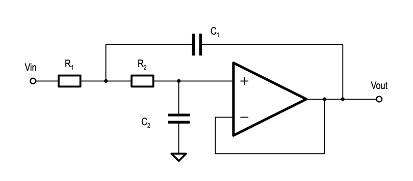

# uec2-lab1

**Wszystkie komendy należy wywoływać z głównego folderu projektu** (w tym wypadku `uec2_lab1_student`).\
_Każdy plik w projekcie posiada nagłówek z krótkim opisem jego funkcji._

## Inicjalizacja środowiska

Aby rozpocząć pracę z projektem, należy uruchomić terminal w folderze projektu i zainicjalizować środowisko:

```bash
. env.sh
```

Po tym kroku, jednorazowo (przy pierwszym uruchomieniu projektu) warto zapisać zmiany w repozytorium jako pierwszy *commit*:

```bash
git commit -am "Initial commit"
```

Komendę `. env.sh` trzeba uruchomić za każdym razem, gdy rozpoczynamy pracę w nowej sesji terminala. Następnie, pozostając w głównym folderze, można wywoływać dostępne narzędzia:

* `run_simulation.sh`
* `generate_bitstream.sh`
* `program_fpga.sh`
* `clean.sh`

Narzędzia te zostały opisane poniżej.

## Uruchamianie symulacji

Symulacje uruchamia się skryptem `run_simulation.sh`.

### Przygotowanie testu

Aby skrypt poprawnie uruchomił symulacje, zawartość testu musi zostać przygotowana zgodnie z poniższym opisem:

* w folderze `sim` należy utworzyć folder, którego nazwa będzie nazwą testu
* w folderze testu należy umieścić:
  * plik o tej samej nazwie, co nazwa testu, z rozszerzeniu `.prj`
  * plik o tej samej nazwie, co nazwa testu, z dopiskiem `_tb.sv`

Przykładowa struktura:

```text
├── sim
│   ├── and2
│   │   ├── and2.prj
│   │   ├── and2_tb.sv
│   │   └── jakis_pomocniczy_modul_do_symulacji.v
```

W pliku `.prj` należy umieścić ścieżki do plików zawierających moduły używane w symulacji. Ścieżki te muszą zostać podane względem lokalizacji pliku `.prj`. Przykładowa zawartość pliku `.prj` wygląda następująco:

```properties
sv      work  and2_tb.sv \
              ../../rtl/and2.sv
verilog work  jakis_pomocniczy_modul_do_symulacji.v
vhdl    work  ../../rtl/jakis_modul_w_vhdl.vhd
```

* pierwsze słowo określa język, w ktorym napisano moduł
* drugie - bibliotekę (tutaj należy zostawić `work`)
* trzecie i kolejne - ścieżki do plików (w przypadku vhdl należy podawać po jednym pliku na linię).

Jeśli któryś z modułów importuje pakiet (_package_), to ścieżka do pakietu powinna pojawić się na liście *przed* ścieżkami do modułów.

Jeśli w symulowanych modułach znajdują się bloki IP, to do pliku `.prj` należy dopisać poniższą linijkę:

```properties
verilog work ../common/glbl.v
```

W pliku `<nazwa_testu>_tb.sv` należy napisać moduł testowy. Nazwa modułu musi być taka sama, jak nazwa testu. (W ogóle należy przyjąć zasadę, że nazwa pliku powinna być identyczna jak nazwa modułu, który w nim zdefiniowano.)

### Dostępne opcje skryptu `run_simulation.sh`

* Wyświetlenie listy dostępnych testów

  ```bash
  run_simulation.sh -l
  ```

* Uruchamianie symulacji w trybie tekstowym

  ```bash
  run_simulation.sh -t <nazwa_testu>
  ```

* Uruchamianie symulacji w trybie graficznym

  ```bash
  run_simulation.sh -gt <nazwa_testu>
  ```

* Uruchamianie wszystkich symulacji

  ```bash
  run_simulation.sh -a
  ```

  W tym trybie, po kolei uruchamiane są wszystkie symulacje dostępne w folderze `sim`, a w terminalu wyświetlana jest informacja o ich wyniku:

  * PASSED - jeśli nie wykryto żadnych błędów,
  * FAILED - jeśli podczas symulacji wykryto błędy (w logu przynajmniej raz pojawiło się słowo _error_).

  Aby test działał poprawnie, należy w testbenchu stosować **asercje**, które w przypadku niespełnienia warunku zwrócą `$error`.

## Generowanie bitstreamu

```bash
generate_bitstream.sh
```

Skrypt ten uruchamia generację bitstreamu, który finalnie znajdzie się w folderze `results`. Następnie sprawdza logi z syntezy i implementacji pod kątem ewentualnych ostrzeżeń (_warning_, _critical warning_) i błędów (_error_), a w razie ich wystąpienie kopiuje ich treść do pliku `results/warning_summary.log`.

## Wgrywanie bitstreamu do Basys3

```bash
program_fpga.sh
```

Aby skrypt poprawnie wgrał bitstream do FPGA, w folderze `results` musi znajdować się **tylko jeden** plik z rozszerzeniem `.bit`.

## Sprzątanie projektu

**UWAGA:** skrypt `clean.sh` kasuje wszystkie pliki i foldery, które są wymienione w `.gitignore`! Zanim go użyjesz, przeanalizuj zawartość `.gitignore` i upewnij się, że nie ma na liście żadnych plików lub folderów, które chcesz zignorować w kontroli wersji, ale nie chcesz ich kasować. Dopóki nie dodasz w folderze i podfolderach projektu (i do `.gitignore`) niestandardowych plików (np. konfiguracji w pliku `*.code-workspace`, folderze `.vscode`, czy niestandardowej konfiguracji w folderze `.dvt`), skorzystanie z `clean.sh` nie powinno powodować problemów.

```bash
clean.sh
```

Zadaniem tego skryptu jest usunięcie wszystkich plików tymczasowych wygenerowanych wskutek działania narzędzi. Pliki te muszą być wymienione w `.gitignore`, a w projekcie musi być zainicjalizowane repozytorium git (inicjalizację tę wykonuje `env.sh`).

Ponadto, skrypty do symulacji oraz generacji bitstreamu, przy każdym ich uruchomieniu (o ile w projekcie zainicjalizowane jest repozytorium git), kasują wyniki poprzednich operacji przed uruchomieniem nowych.

## Uruchamianie projektu w Vivado w trybie graficznym

Aby otworzyć w Vivado w trybie graficznym zbudowany projekt (tzn. po zakończeniu działania `generate_bitstream.sh`), należy przejść do folderu `fpga/build` i wywołać w nim komendę:

```bash
vivado <nazwa_projektu>.xpr
```

## W razie niepowodzenia symulacji lub generacji bitstreamu

Jeśli symulacja lub generacji bitstreamu nie przebiega poprawnie, należy szukać przyczyny czytając w terminalu log, ze szczególnym uwzględnieniem linijek zawierających *ERROR*. Często najcenniejszą informację znajdziemy szukając pierwszego wystąpienia *ERROR*a.

Jeśli po uruchomienie narzędzia, w terminalu wyświetla się:

```bash
Vivado%
```

oznacza to, że skrypt poprawnie uruchomił Vivado w trybie tekstowym, ale prawdopodobnie wystąpił błąd w plikach źródłowych, lub w ogóle ich nie znaleziono. Aby zamknąć Vivado wystarczy wpisać w terminalu

```tcl
exit
```

Jeśli uważne przeglądnięcie logów nie przyniosło rozwiązania, można spróbować, zamiast zamykania Vivado, uruchomić tryb graficzny i przeglądnąć widzianą przez program zawartość projektu. Wówczas, widząc napis `Vivado%`, należy wpisać w terminalu:

```tcl
start_gui
```

Jeśli potrzebujemy przerwać uruchomiony proces, możemy skorzystać z kombinacji <kbd>Ctrl</kbd>+<kbd>C</kbd>.

## Struktura projektu

Poniżej przedstawiono hierarchię plików w projekcie. Aby wszystkie narzędzia działały poprawnie, należy jej przestrzegać.

```text
.
├── env.sh                         - konfiguracja środowiska
├── fpga                           - pliki związane z FPGA
│   ├── constraints                - * pliki xdc
│   │   └── top_vga_basys3.xdc
│   ├── rtl                        - * syntezowalne pliki związane z FPGA
│   │   └── top_vga_basys3.sv      - * * moduł instancjonujący nadrzędny moduł projektu rtl/top* oraz bloki
│   │                                    specyficzne dla FPGA (np. bufory lub sentezator częstotliwości zegara)
│   └── scripts                    - * skrypty tcl (uruchamiane odpowiednimi narzędziami z tools)
│       ├── generate_bitstream.tcl
│       ├── program_fpga.tcl
│       └── project_details.tcl    - * * informacje o nazwie projektu, module top i plikach do syntezy
├── README.md                      - ten plik
├── results                        - pliki wynikowe generacji bitstreamu
│   ├── top_vga_basys3.bit         - * bitstream
│   └── warning_summary.log        - * podsumowanie ostrzeżeń i błędów
├── rtl                            - syntezowalne pliki projektu (niezależne od FPGA)
│   ├── draw_bg.sv
│   ├── top_vga.sv                 - * moduł nadrzędny (top)
│   ├── vga_pkg.sv                 - * pakiet zawierający stałe używane w projekcie
│   └── vga_timing.sv
├── sim                            - folder z testami
│   ├── common                     - * pliki wspólne dla wielu testów
│   │   └── glbl.v                 - * * plik potrzebny do symulacji z IP corami; tworzony przy wywołaniu env.sh
│   │   └── tiff_writer.sv
│   ├── top_fpga                   - * folder pojedynczego testu
│   │   ├── top_fpga.prj           - * * lista plików z modułami używanymi w teście
│   │   └── top_fpga_tb.sv         - * * kod testbenchu
│   ├── top_vga
│   │   ├── top_vga.prj
│   │   └── top_vga_tb.sv
│   └── vga_timing
│       ├── vga_timing.prj
│       └── vga_timing_tb.sv
└── tools                          - narzędzia do pracy z projektem
    ├── clean.sh                   - * czyszczenie plików tymczasowych
    ├── generate_bitstream.sh      - * generacja bitstreamu (uruchamia też warning_summary.sh)
    ├── program_fpga.sh            - * wgrywanie bitstreamu do FPGA
    ├── run_simulation.sh          - * uruchamianie symulacji
    ├── sim_cmd.tcl                - * komedy tcl używane przez run_simulation.sh (nie należy wywoływać samodzielnie)
    └── warning_summary.sh         - * filtrowanie ostrzeżeń i błędów z generacji bitstreamu (wynik w results)
```

### Folder **fpga**

W tym folderze znajdują się pliki powiązane stricte z FPGA. Plik `fpga/rtl/top_*_basys3.sv` zawiera instancję funkcjonalnego topa projektu (`rtl/top*.sv`) oraz bloki IP specyficzne dla FPGA. Pozwala również zrealizować mapowanie funkcjonalnych portów projektu na fizyczne wyprowadzenia na PCB, np:

```sv
.rst(btnC),
.ready(led[0])
```

W pliku `fpga/scripts/project_details.tcl` należy podać nazwę projektu, nazwę głównego modułu (top fpga) oraz ścieżki do wszystkich plików zawierających moduły używane do syntezy. Ścieżki te należy podawać **względem lokalizacji folderu `fpga`** (a nie względem pliku _.tcl_).

### Folder **rtl**

Tutaj znajdują się syntezowalne pliki projektu, nie powiązane bezpośrednio z FPGA. Wśród nich znajduje się moduł nadrzędny (_top_), który powinien mieć budowę wyłącznie strukturalną (tzn. powinien zawierać instancje modułów podrzędnych i łączyć je ze sobą _wire_-ami, a nie powinien zawierać żadnych bloków _always_). W miarę przybywania plików w folderze `rtl`, warto rozważyć utworzenie podfolderów w celu grupowania powiązanych ze sobą tematycznie plików.

## Weryfikacja poprawności napisanego kodu

Do sprawdzenia poprawności napisanego kodu w języku SystemVerilog na serwerze studenckim i stacjach roboczych w laboratorium P014 należy skorzystać ze skonfigorwanego w tym celu narzędzia _Cadence HDL analysis and lint tool (HAL)_.

Aby sprawdzić kod pod kątem syntezy należy wywołać polecenie:

```bash
hal_mtm_rtl.sh <ścieżki do sprawdzanego pliku i plików zależnych>
```

Aby sprawdzić kod pod kątem symulacji należy wywołać polecenie:

```bash
hal_mtm_tb.sh <ścieżki do sprawdzanego pliku i plików zależnych>
```

Podobnie jak w pliku `.prj`, pliki pakietów należy podawać jako pierwsze.

Wynik analizy prezentowany jest w terminalu, a pełny log dostępny jest w pliku `xrun.log`.

## XADC Analog Connections

To safely connect an RCA line-level signal (2V p-p, centered at 0V) to the Basys3 JXADC header, the following conditioning circuit is required for each channel (Left/Right):

| Component | Connection From | Connection To |
| :--- | :--- | :--- |
| **Capacitor** ($10\mu\text{F}$) | RCA Signal (Center) | JXADC Pin 1 / Pin 2 (`vauxp6` / `vauxp14`) |
| **Resistor** ($10\text{k}\Omega$) | JXADC Pin 1 / Pin 2 | **3.3V** (JXADC Pin 6 or 12) |
| **Resistor** ($2.2\text{k}\Omega$) | JXADC Pin 1 / Pin 2 | **GND** (JXADC Pin 5 or 11) |
| **Direct Wire** | RCA Ground (Outer) | JXADC Pin 7 / Pin 8 (`vauxn6` / `vauxn14`) |

**Technical Note:** The Artix-7 XADC input range is 0V-1V. The circuit above biases the signal to ~0.6V and provides high-pass coupling to protect the FPGA from negative voltages.
## Active Audio Output Filter

To achieve professional-grade audio quality, the Delta-Sigma bitstream from the FPGA must be processed by an external Active Sallen-Key Low-Pass Filter.



### Filter Components

| Component | Value |
| :--- | :--- |
| **R1** | 1 kΩ |
| **R2** | 1 kΩ |
| **C1** | 10 nF |
| **C2** | 4.7 nF |

### Connection Diagram

Connect the Basys3 board to your external filter circuit using the **Pmod JA** header:

| Basys3 Port | Pmod JA Pin | Filter Connection |
| :--- | :--- | :--- |
| **JA1 (Signal)** | Pin 1 | Filter Input (R1) |
| **GND** | Pin 5 | Circuit Ground |

**Note:** The output of the op-amp should be AC-coupled (using a 10µF capacitor) before connecting to a DJ mixer or line-level input to remove the DC offset.

## Audio Format Conversion (MP3 / WAV to 8-bit Raw Binary)

To convert audio files (such as `.mp3` or `.wav`) into a raw 8-bit PCM binary format suitable for playback at 44.1 kHz, use `ffmpeg`.

### 1. Convert Audio to Unsigned 8-bit Raw PCM (0 to 255)
```bash
ffmpeg -i input.mp3 -ar 44100 -ac 1 -f u8 output.bin
```

### 2. Convert Audio to Signed 8-bit Raw PCM (-128 to 127)
```bash
ffmpeg -i input.mp3 -ar 44100 -ac 1 -f s8 output_s8.bin
```

### Command Options Explained:
- `-i input.mp3`: Path to input audio file (MP3, WAV, FLAC, etc.)
- `-ar 44100`: Sets the sample rate to **44.1 kHz**
- `-ac 1`: Converts audio to **mono** (1 channel)
- `-f u8` / `-f s8`: Specifies raw headerless 8-bit PCM output (**unsigned `u8`** or **signed `s8`**)

### Playback & Verification using `ffplay`
To test playback of the raw binary file:
```bash
# Play unsigned 8-bit raw binary file
ffplay -f u8 -sample_rate 44100 -ch_layout mono output.bin

# Play signed 8-bit raw binary file
ffplay -f s8 -sample_rate 44100 -ch_layout mono output_s8.bin
```

